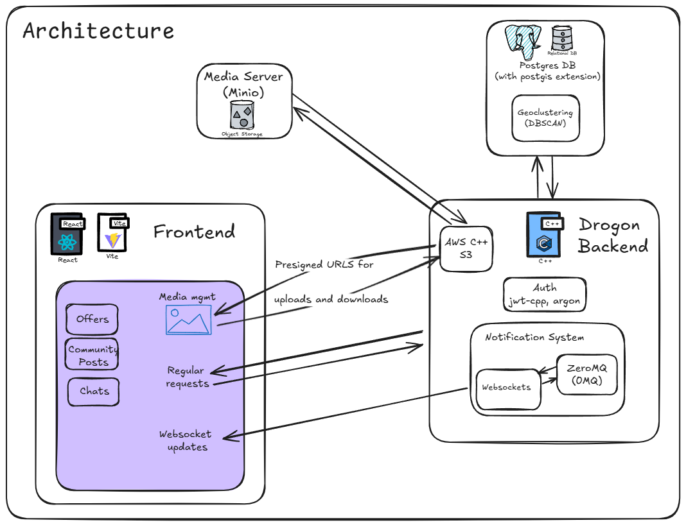

# Buyer Backend

Demo app for a Drogon C++ Backend Application.

It demonstrates the following:

* Authentication using JWT with a simple refresh mechanism and an Auth middleware.
* Password hashing with Argon.
* Database queries with coroutines.
* Pub/Sub system for notifications using ZeroMQ.
* Clustering of geographic coordinates using `postgis` Postgres extension.
* Media management with S3 compatible Minio Object Store and presigned links.
* Integration tests.

## Architecture



### Related repositories

* Frontend: [`buyer-frontend`](https://github.com/uzoochogu/buyer-frontend)
* Backend: `buyer-backend` (this repository)

Please note working directory and relative paths differs based on build system e.g. MSVC uses Debug/Release folders

## Installing Dependencies

Install Postgres on your test machine, either [locally](https://www.postgresql.org/download/) or through [docker](https://hub.docker.com/_/postgres).

[`vcpkg`](https://vcpkg.io/en/packages?query=) can be used to manage library dependencies. Here is a [`guide`](https://learn.microsoft.com/en-gb/vcpkg/get_started/get-started) to installing it.

Below are some of the dependencies that are used in the project:

- [drogon](https://github.com/drogonframework/drogon) - with some submodules and sub-dependencies like JsonCpp.
- [argon2](https://github.com/P-H-C/phc-winner-argon2.git)
- [jwt-cpp](https://github.com/Thalhammer/jwt-cpp)
- [cppzmq](https://github.com/zeromq/cppzmq) - Pub/Sub, Notification system.
- ~~[redis-plus-plus](https://github.com/sewenew/redis-plus-plus)~~ - Not currently used or but code stub is present.
- [boost-uuid](https://www.boost.org/libs/uuid) - Faster UUID than Drogon UUID utility.
- [aws-sdk-cpp](https://github.com/aws/aws-sdk-cpp) - Only using S3 component for S3 compatible Minio Service.

Installing using vcpkg:

```bash
# Installing within the project:
# in project root, run this
vcpkg install


# OR

# Installing globally
# triplet_name here depends on your system e.g. x64-windows-static or x64-windows
# you can ignore :triplet_name as defaults are reasonable for most platforms
./vcpkg install drogon[core,ctl,orm,postgres]:triplet_name --recurse
./vcpkg install jwt-cpp:triplet_name
./vcpkg install argon2[hwopt,tool]:triplet_name
./vcpkg install cppzmq:triplet_name
./vcpkg install redis-plus-plus[async,tls,cxx17]:triplet_name  # currently not used, so can be ignored.
./vcpkg install boost-uuid:triplet_name
./vcpkg install aws-sdk-cpp[s3]:triplet_name
```

More information on setting up the drogon-ctl tool can be found [in this guide](https://github.com/drogonframework/drogon/wiki/ENG-02-Installation#Drogon-Installation)

### Compilation

```bash
# Configure CMake

# if you installed vcpkg packages globally, you may need to turn off manifest mode
# and should provide the vcpkg.cmake path
cmake -B ./build -S . "-DCMAKE_TOOLCHAIN_FILE=C:/dev/vcpkg/scripts/buildsystems/vcpkg.cmake" -DVCPKG_MANIFEST_MODE=OFF

# OR using manifest mode (packages are automatically installed project level)
cmake -B ./build -S . "-DCMAKE_TOOLCHAIN_FILE=C:/dev/vcpkg/scripts/buildsystems/vcpkg.cmake"

# Build
cmake --build build --config Release --parallel

# clean build
cmake --build build --config Release --parallel --clean-first
```

### Running the Backend

Modify the configuration files to setup correct backend runtime environment.
Create `test_config.json` and `config.json` from the provided sample files: [`config-sample.json`](./config-sample.json) and [`test_config-sample`](./test_config-sample.json).

Fill in the correct details especially the database connection details.

```bash
$ ./buyer-backend.exe --help
Usage: buyer-backend [OPTIONS]

Options:
  --test, -t       Run in test mode using test_config.json.
                   Searches up to 3 parent directories up.
  --config <file>  Use specified config file.
                   Searches up to 3 parent directories up.
  --help, -h       Display this help message and exit.
```

```bash
# Run with default config
./buyer-backend
```

By default it runs on `5555`, but can be configured using the configuration file.

### Drogon Framework Commands

#### Create Components

```bash
# Create Filter
drogon_ctl create filter AuthMiddleware

# Create Controller
drogon_ctl create controller -h api::v1::login

# Create Model - Note that we currently don't use the drogon orm
drogon_ctl create model ./models
```

To see the full list of commands provided by `drogon_ctl`, use `drogon_ctl --help` and `drogon_ctl help create`.

## Testing Backend

Integration tests using the Drogon built-in test framework.

### Configure Tests

This can be done once, or whenever the test configuration changes.

Create `setup_test_db.bat` and `setup_test_db.sh` from the provided sample files:  [`setup_test_db-sample.bat`](./scripts/setup_test_db-sample.bat) and [`setup_test_db-sample.sh`](./scripts/setup_test_db-sample.sh).

Fill in the correct database connection details.

```bash
cmake --build build --target configure_tests
```

### Build Tests

```bash
# Release build
cmake --build build --config Release --target buyer_backend_test

# Debug build
cmake --build build --config Debug --target buyer_backend_test
```

### Run Tests

```bash
# Run main application
./buyer-backend --test-mode

# Method 1: Run tests either using ctest...(Slower provides more info)
# From ~/buyer-backend/build/test
ctest -C Release
# or
ctest -C Debug
# Note that -V flag gives verbose output

# This runs a specific ctest
ctest -C Release -R ChatsTest


# Method 2: run test executable directly (Runs faster)
./buyer_backend_test

# This runs a specific test through the test executable
./buyer_backend_test -r ChatsTest
```

### Notes for Integration testing

1. Ensure that there no active connection to the PostgreSQL DB before configuring tests. This can cause errors in the setup scripts
2. Run main application in test mode in separate terminal before running integration tests or else integration tests segfaults.

   ```bash
   ./buyer-backend --test-mode 
   # or
   ./buyer-backend -t
   ```

   The test executable makes requests processed by the main application server. Running main server in test mode ensures that it is connected to the correct test database.

## Database Management

### Creating Database

```bash
createdb agentbackend
# or with custom parameters
createdb -h %DB_HOST% -p %DB_PORT% -U %DB_USER% %DB_NAME%
```

### Reset Database

```bash
psql -U postgres -d agentbackend -c "DROP SCHEMA public CASCADE; CREATE SCHEMA public;"
```

### Running Migrations

```bash
psql -U postgres -d agentbackend -f migrations/001_complete_schema.sql

# test DB ( or auto-generate using the configure_tests cmake target)
psqll -U postgres -d buyer_app_test -f migrations/001_complete_schema.sql
```

> Ensure your Postgres installation has postgis extension support as this migration, creates the extension.

### Seeding Data

```bash
psql -U postgres -d agentbackend -f seeds/001_complete_seed_data.sql

# for test DB ( or auto-seed using the configure_tests cmake target)
psql -U postgres -d buyer_app_test -f seeds/001_complete_seed_data.sql
```

## Media Server

Minio Object Store is used for storing and serving media files. It has an AWS S3 compatible API.

### Installation

```bash
# Install Minio
docker run --name minio-media-server -p 9000:9000 -p 9001:9001 -v /c/dev/media_store:/data -e "MINIO_ROOT_USER=minioadmin" -e "MINIO_ROOT_PASSWORD=password" minio/minio server /data --console-address ":9001"
```

Replace `-v /c/dev/media_store:/data` with the path to the media store directory on your machine for persistent storage.
If you modify the credentials, make sure to update your created `config.json` and `test_config-sample.json` files.

## Using Docker Compose (Experimental)

A [`docker-compose.yml`](./docker-compose.yml) file is provided for running the postgres database and media server services and optionally, the main application (uncomment it to enable).

> If you are using docker compose, you can remove the custom targets for setting up the test DB.

You can compose up and down the containers using the following commands:

```bash
# Compose up
docker compose up -d

# Compose down
docker compose down

# subsequent runs can be started and stopped using
docker compose start

docker compose stop
```

> Note that this is still experimental and may not work as expected.

## Debugging tips

* If you are getting a 500 error instead of a 400 error, then you are not validating the data coming from the request (body and Headers).

* If you are getting 200 or 201 error when you aren't supposed to, then you are not validating your input data. Maybe empty data?

* Note where you add logs. Putting logs in the test side outputs in the test run, logs in the normal application outputs in the server logs

* Try to initialize the Json values as much as possible. Especially Array responses.

- Using the `["key"]` accessor in JsonCpp default constructs that field if it doesn't exists, prefer `.isMember("key")` to check for membership.

* If you want to inspect the Database after a test run, remove the teardown delete queries, recompile and rerun tests. This way you have access to it after a run for more better investigations.

* Use Drogon LOG_INFO and LOG_ERROR macros for logging. For Json responses this helps:

```cpp
  LOG_INFO << json_response.toStyledString();
  // or use .type() to check e.g.
  if (json_response.type() == Json::ValueType::objectValue)
```
